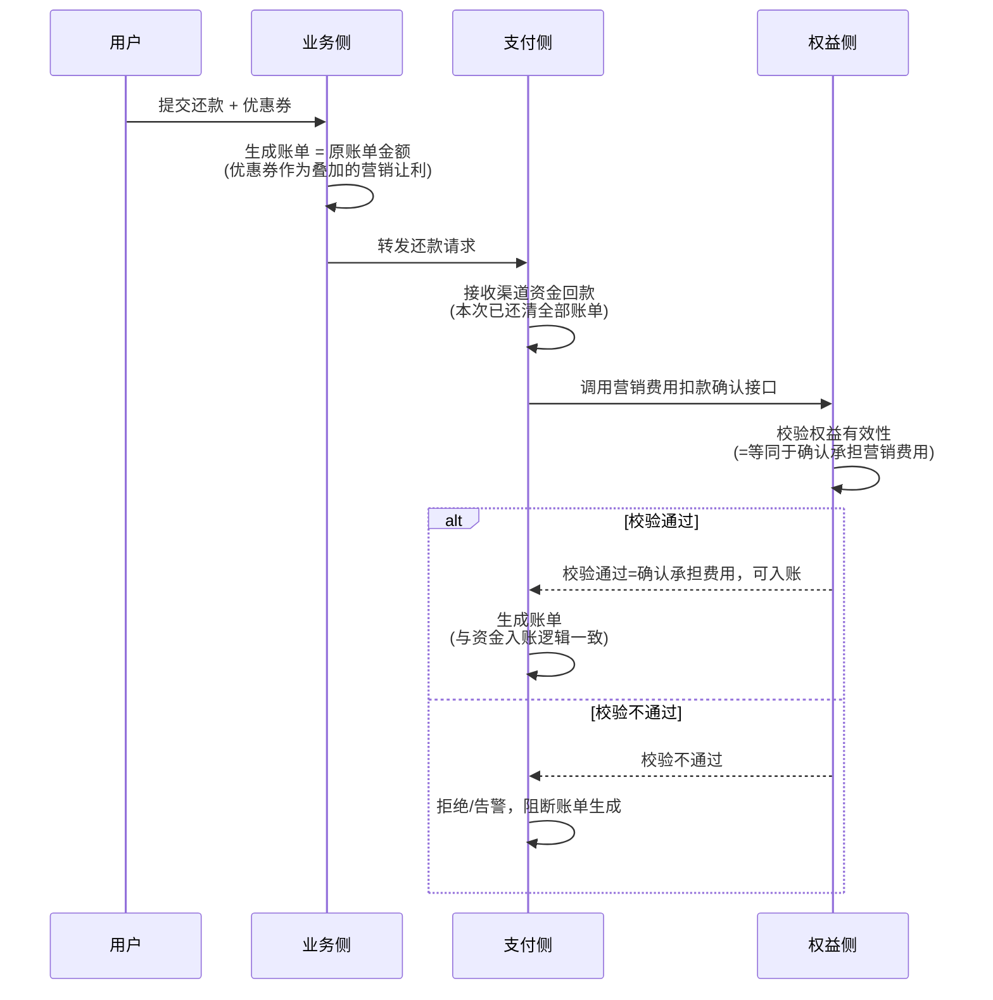
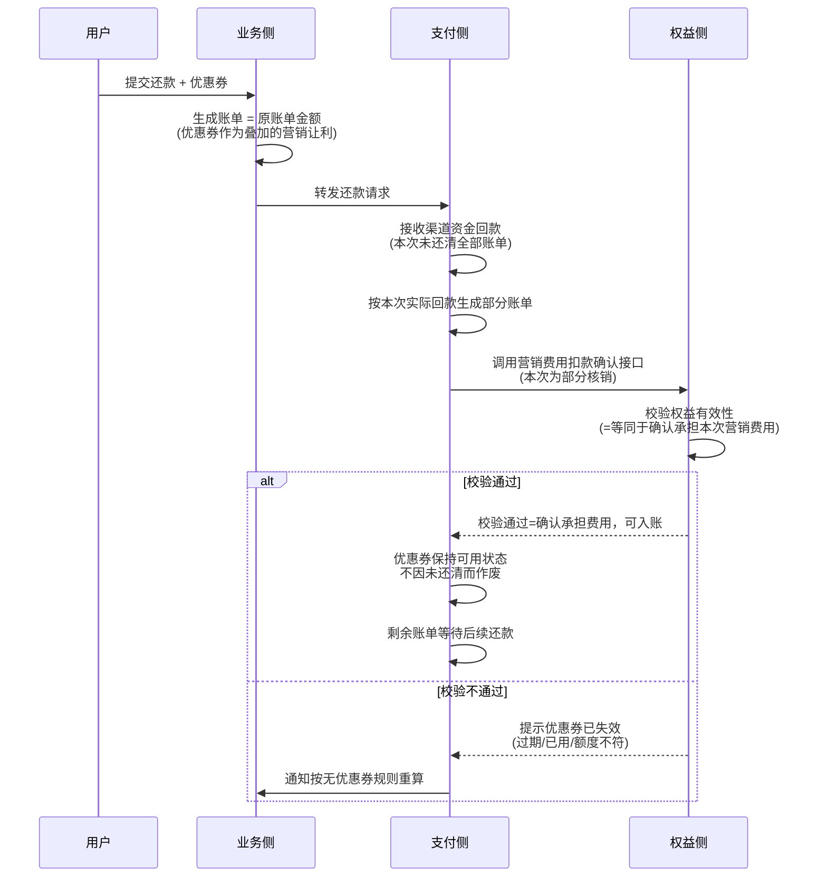
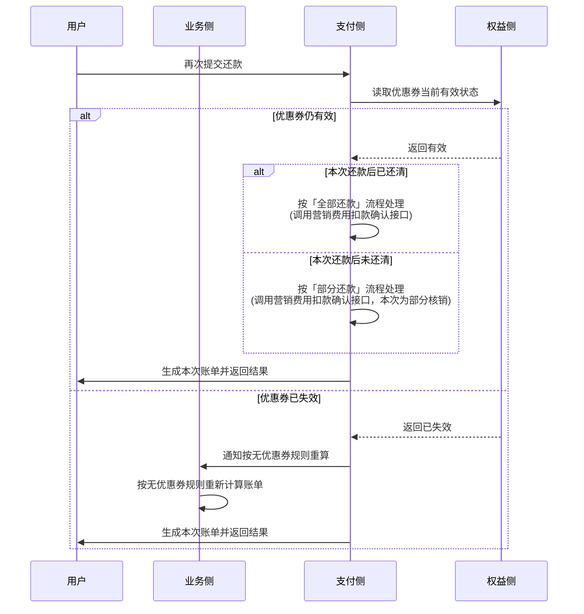
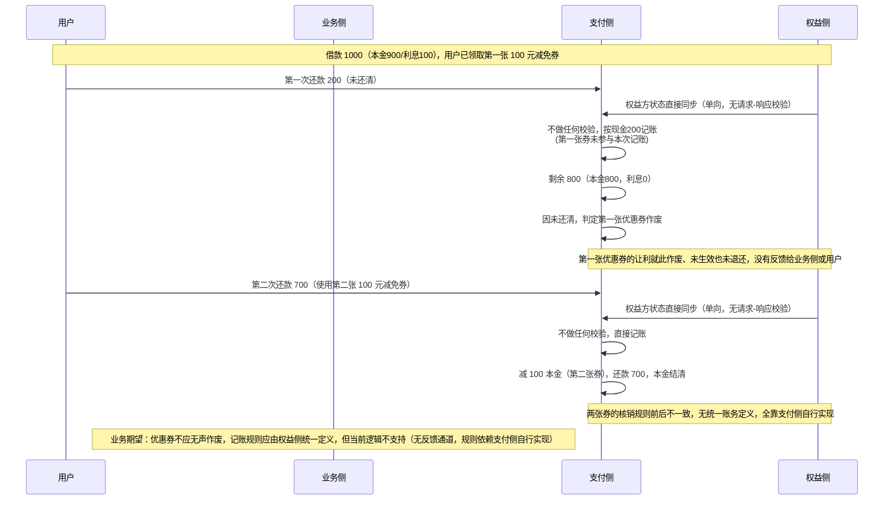

# 信贷还款中优惠券（权益）与支付链路的问题记录

## 背景

用户在还款时可以叠加使用优惠券。理想情况下，优惠券只是在账单之外叠加的一层营销让利，不应该侵入支付/资金核对的核心链路。当前系统的实现方式把权益的状态校验完全省略，直接由支付侧根据渠道回款金额生成账单，存在时效性和正确性风险。

### 角色说明

全文统一使用以下四个角色，图和文字保持一致；括号内是系统里常见的对应叫法：

- **用户**：还款的发起方（有时也写作 BC）。
- **业务侧**：接收用户的还款请求，计算账单（含优惠券叠加逻辑），转发给支付侧。
- **支付侧**：负责接收渠道回款、资金入账、生成账单（系统内部常称 BIZ / Bizpay）。
- **权益侧**：负责优惠券/权益的定义、状态管理，以及核销时的有效性校验。

## 理想模式

- 用户提交还款请求时，若使用了优惠券，相当于在原账单基础上叠加一张优惠券（即：账单金额保持不变，优惠券部分作为营销费用单独承担）。
- 支付侧接收渠道回款后，识别到用户选择"全部还款"（即使用优惠券后实际支付的金额已覆盖账单），此时需要**主动调用权益方提供的"营销费用扣款确认"接口**，通知权益方确认这笔营销费用由权益方承担。
- 该调用应与资金入账逻辑保持一致（即在确认收到回款、生成账单的同一事务/流程节点触发）。**校验权益有效性与权益方确认承担营销费用，本质上是同一个逻辑**：权益有效性校验通过，就等同于权益方确认承担这笔营销费用；也就是说，"校验通过"这个动作本身，就代表系统承认这笔营销费用可以入账。不存在校验通过之后还需要单独一次"确认"的步骤。这个等价关系成立的前提是——权益方系统设计上，"校验通过"本身就代表权益方对这笔让利的确认，两者在权益方内部是同一次判断，而不是支付侧单方面的假设。

## 当前模式（问题所在）

### 问题现象

- 所有权益（优惠券）状态由权益方单向同步给支付，**支付不做任何校验**。
- 支付直接根据回款金额生成账单，权益是否有效、是否该由权益方承担费用，全部没有二次确认。
- 扣款确认（营销费用扣款）没有明确的触发时机保证，**时效性无法保证**。

### 问题后果

权益的实施逻辑被耦合进了支付链路里，导致：

- 支付链路无法独立校验资金和权益的一致性；
- 权益方无法准确、及时地确认自己应承担的费用；
- 一旦权益状态同步延迟或出错，账单生成不会被阻塞或修正，容易产生资金对不上的风险。

### 典型场景：分次还款下优惠券被错误作废

设定一笔还款绑定的支付与权益后，如果用户只还了一半，且此后停止还款，**当前优惠券就会被直接作废**；但业务部门希望优惠券不应因未还完全部账单就失效，而应在用户后续继续还款时仍可使用。当前逻辑无法支持，根本原因还是同一个——权益的使用和校验逻辑被耦合、简化在支付链路里，支付只根据一次性的回款结果去判断优惠券是否"用掉"或"作废"，而不是把优惠券的生命周期（有效期、剩余可用状态、是否已核销）作为一个独立的、可以被多次校验和确认的状态来管理。

下面的历史真实案例，就是这个"典型场景"的一次真实发生记录。

### 历史真实案例：优惠券被静默作废 + 记账规则不统一

以下是一个已经发生过的真实问题案例（非假设场景）：

- 用户借款 1000（本金 900，利息 100）。
- 用户领取了**第一张** 100 元减免券。
- **第一次还款**：用户还了 200，未还清。
  - 支付侧入账：剩余 800（本金 800，利息 0）——按利息优先摊销，200 元里 100 冲抵利息、100 冲抵本金，得到本金 800、利息 0，这个结果和"用了 100 元券"完全无关，说明第一张券在这次还款里**没有产生任何实际抵扣效果**。
  - 因为本次未还清，系统按当前逻辑判定**第一张优惠券作废**：这 100 元的让利既没有冲抵本金或利息，也没有退还或保留给用户，就此凭空消失，业务侧和用户都没有收到任何提示。
  - **需要额外指出的一点（次要问题）**：第一张券**既没有被核销、也没有被实际使用**——它没有产生任何抵扣效果，严格来说不满足"已使用"的条件。从权益生命周期的角度看，一张未核销、未使用的券，理论上应该仍然是可用状态，用户后续应该还能拿它去核销；但当前逻辑只要账单本次没还清，就直接把券判定作废，并不区分"这张券到底有没有被用过"。这个问题相对上面"记账口径不统一"的影响要小，但同样反映了优惠券没有被当作一个独立的、有生命周期的状态来管理。
- **第二次还款**：用户使用了**第二张**（另一张）100 元减免券，还款 700。
  - 支付侧记账：减 100 本金（第二张券），现金还款 700，本金结清（800 − 100 − 700 = 0）。

两次还款加总：现金 200 + 700 = 900，加上第二张券抵扣的 100，正好等于原始借款 1000，账面上是能对平的。但这恰恰说明问题所在：**第一张券的 100 元让利被无声浪费掉了**，用户实际上只享受到了第二张券的优惠，而系统既没有记录"第一张券作废"这件事，也没有把两张券的核销规则统一起来——为什么第一次没有生效、第二次却直接冲抵本金，全靠支付侧临场处理，没有统一标准。

从权益侧来看，它暴露的根本问题是：**权益和支付之间目前仍然是"交易型集成"**——权益只是把"这张券可以用、面值多少"同步给支付，至于这笔减免具体应该在哪一次还款中生效、生效后账务上如何拆分、未生效时该如何处理，全部依赖支付侧在核销时自行理解、自行实现。当实现存在差异或遗漏时，就会出现像上面这样"优惠券被静默作废、两次核销规则不一致"的问题。

## 核心结论

权益（优惠券/营销费用）的校验与确认逻辑，不应该被压缩、省略进支付的资金入账链路中。支付应该在生成账单前，对涉及权益的部分做显式的校验和确认调用，而不是无条件信任权益方同步过来的状态。

但历史案例进一步说明，仅仅"补上校验"还不够：即便支付侧在每次还款时都去校验权益状态，如果记账口径（这笔优惠券该冲本金还是利息、未生效的优惠券该如何处理、多张券先后核销的顺序规则）仍然由支付侧自行摸索实现，依然会出现像案例中"第一张券无声作废、两张券核销规则不一致"这样的问题。真正要解决的，是把记账规则的定义权收回到权益侧。

## 正确模式：从"交易型集成"走向"账务驱动"

理想模式解决的是**"校验时机"**问题——权益该不该被校验、什么时候被校验；账务驱动解决的是**"校验内容"**问题——校验背后的记账规则由谁定义、是否统一。二者是递进关系：先靠"理想模式"保证每一次还款都会真正经过权益侧的校验和确认（而不是像历史案例中第一张券那样被静默作废、没有任何校验和反馈），再靠"账务驱动"保证校验通过之后，记账规则是权益侧统一定义好的标准，业务侧不需要自行摸索。

当前券更多只是一个"可使用的权益"，入账规则依赖业务侧在核销时自行理解、适配和记账，因此当业务实现存在差异或遗漏时，就可能出现本金、非本金等入账风险问题。

后续权益能力应该进一步往**"账务驱动"**演进：权益在定义"发什么券、怎么用"的同时，应同时定义该权益对应的账务属性和记账规则，并以权益定义作为入账处理的统一依据。

这样业务侧只需要按照权益标准完成消费和核销，不再自行维护各类记账规则，从源头保证入账一致性，也避免不同国家、不同业务实现产生理解偏差。

## 流程图

为便于后续扩展，理想模式与当前模式分别用图表达；理想模式按「全部还款 / 部分还款 / 二次（后续）还款」三种动作展开。

四张图统一按四个业务角色画时序图：**用户 / 业务侧 / 支付侧 / 权益侧**（对应关系见前文"角色说明"）。

### 理想模式 - 全部还款

### 理想模式 - 部分还款

### 理想模式 - 二次/后续还款

### 当前模式（问题）——含历史真实案例数据

