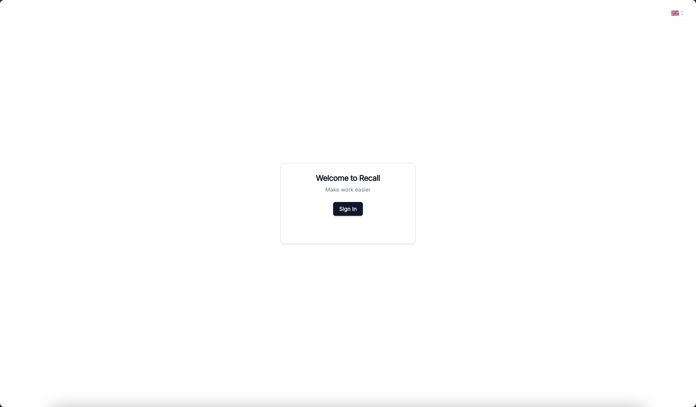
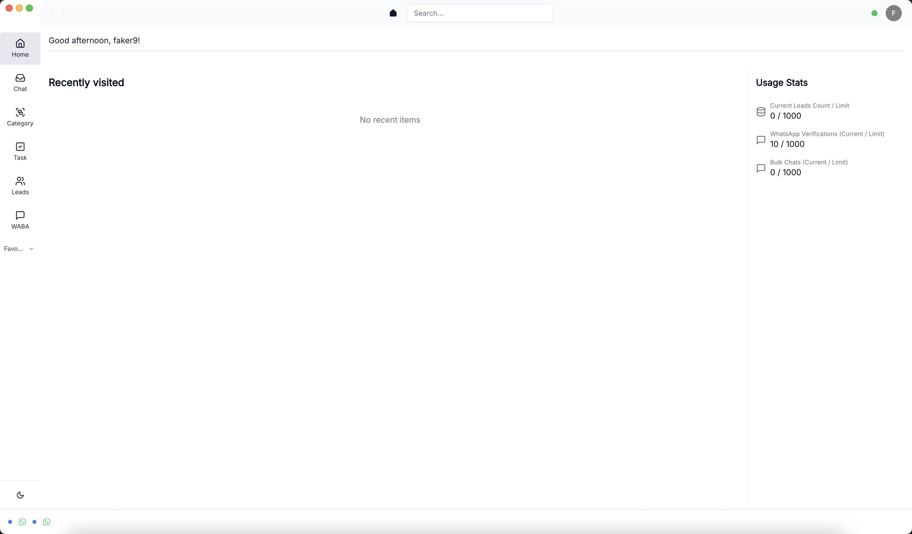
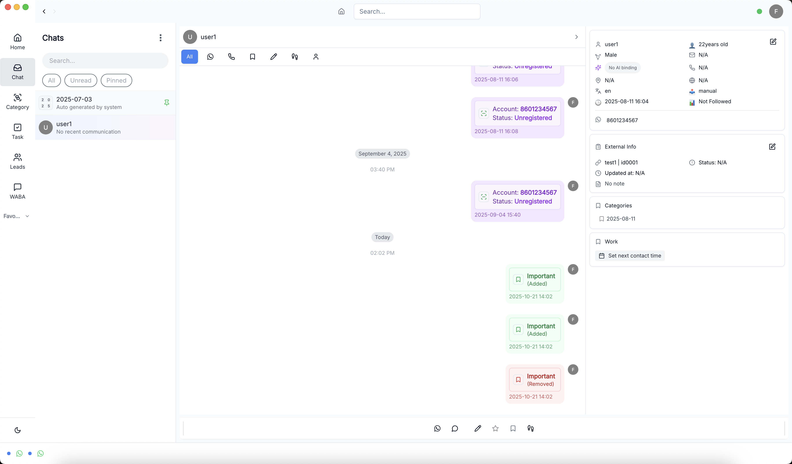
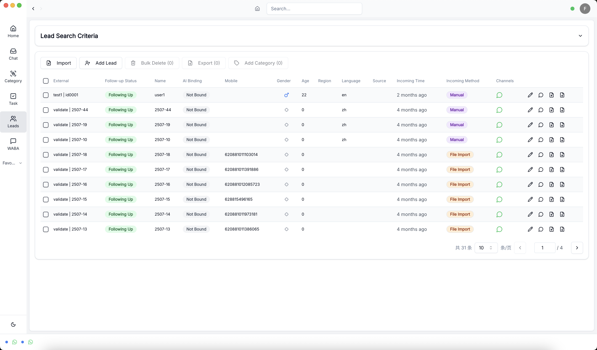
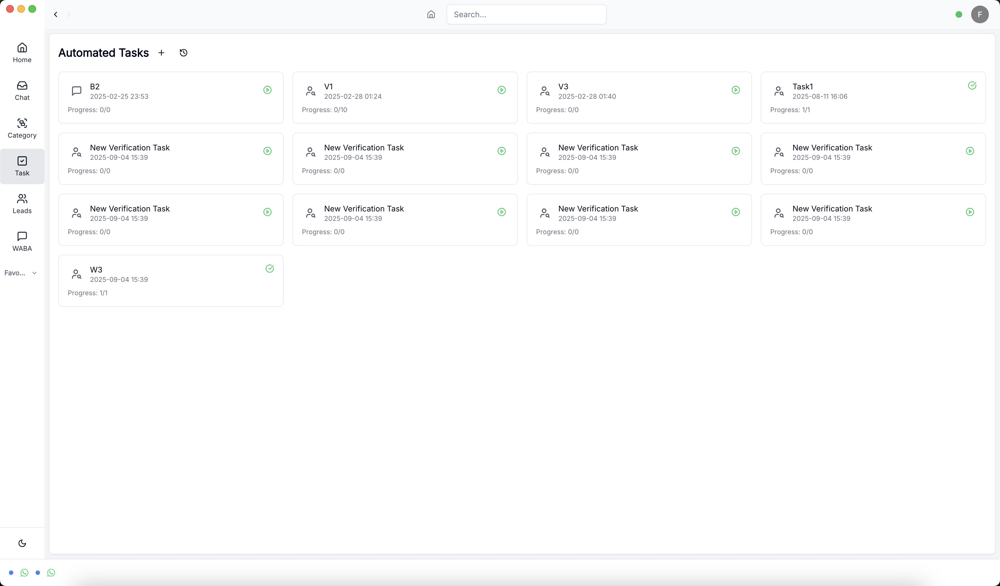
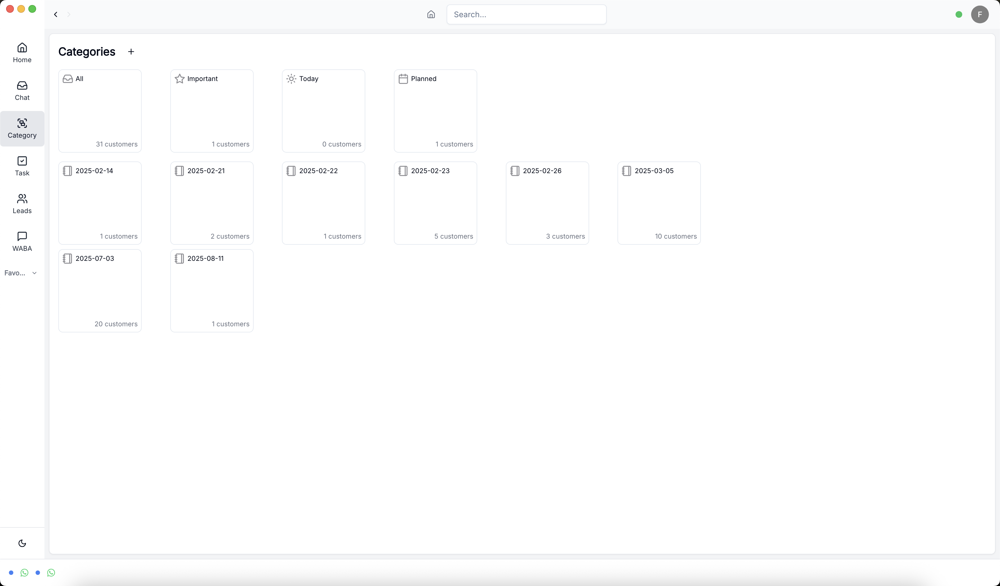

# 客户端操作手册

## 概述

本操作手册详细介绍了客户端各个页面的功能和使用方法。客户端主要包含以下页面：

- 登录页面 (Login)
- 首页 (Home)
- 聊天页面 (Chat)
- 潜在客户页面 (Leads)
- 任务页面 (Tasks)
- 分类页面 (Categories)

---

## 1. 登录页面 (Login)

### 功能描述
用户首次访问系统时的登录入口页面。

### 操作步骤
1. 打开客户端应用
2. 在登录页面输入用户名和密码
3. 点击登录按钮
4. 系统验证成功后自动跳转到首页

### 注意事项
- 请确保输入正确的用户名和密码
- 如忘记密码，请联系系统管理员
- 登录成功后会自动跳转到首页

### 相关截图

---

## 2. 首页 (Home)

### 功能描述
系统的主页面，提供整体功能导航和重要信息展示。

### 主要功能
- 系统导航菜单
- 重要信息概览
- 快速操作入口
- 用户状态显示

### 操作说明
1. 查看系统概览信息
2. 通过导航菜单访问其他功能模块
3. 查看重要通知和提醒
4. 进行快速操作

### 相关截图

---

## 3. 聊天页面 (Chat)

### 功能描述
提供实时聊天功能，支持与客户、同事进行沟通交流。

### 主要功能
- 实时消息发送和接收
- 聊天记录查看
- 文件传输
- 表情和贴纸
- 消息搜索

### 操作步骤
1. 选择聊天对象或群组
2. 在输入框中输入消息内容
3. 点击发送按钮发送消息
4. 查看聊天历史记录
5. 使用搜索功能查找特定消息

### 注意事项
- 消息发送前请确认内容正确
- 支持发送图片、文件等多媒体内容
- 聊天记录会自动保存

### 相关截图

---

## 4. 潜在客户页面 (Leads)

### 功能描述
管理潜在客户信息，跟踪销售机会和客户状态。

### 主要功能
- 客户信息管理
- 销售机会跟踪
- 客户状态更新
- 联系记录管理
- 销售漏斗分析

### 操作步骤
1. 查看客户列表
2. 添加新客户信息
3. 编辑客户详细信息
4. 更新客户状态
5. 记录客户沟通历史
6. 分析销售数据

### 数据管理
- 客户基本信息：姓名、公司、联系方式
- 销售阶段：潜在客户、意向客户、成交客户
- 跟进记录：沟通时间、内容、结果

### 相关截图

---

## 5. 任务页面 (Tasks)

### 功能描述
个人和团队任务管理，支持任务创建、分配、跟踪和完成。

### 主要功能
- 任务创建和编辑
- 任务分配和委派
- 任务状态跟踪
- 优先级设置
- 截止日期管理
- 任务提醒

### 操作步骤
1. 创建新任务
   - 输入任务标题和描述
   - 设置优先级和截止日期
   - 分配给相关人员
2. 管理现有任务
   - 查看任务列表
   - 更新任务状态
   - 编辑任务信息
3. 任务跟踪
   - 查看任务进度
   - 设置提醒
   - 完成任务

### 任务状态
- 待处理 (Pending)
- 进行中 (In Progress)
- 已完成 (Completed)
- 已取消 (Cancelled)

### 相关截图

---

## 6. 分类页面 (Categories)

### 功能描述
管理系统分类和标签，用于组织和分类各种数据。

### 主要功能
- 分类创建和管理
- 标签系统
- 分类层级管理
- 数据分类筛选
- 分类统计

### 操作步骤
1. 查看现有分类结构
2. 创建新分类
   - 输入分类名称
   - 设置分类描述
   - 选择父级分类
3. 编辑分类信息
4. 删除不需要的分类
5. 设置分类权限

### 分类管理
- 支持多级分类结构
- 可设置分类颜色和图标
- 支持分类排序
- 提供分类使用统计

### 相关截图

---

## 7. 登录成功页面

### 功能描述
用户成功登录后的确认页面，显示登录状态和系统信息。

### 主要功能
- 登录状态确认
- 用户信息显示
- 系统欢迎信息
- 快速导航

### 操作说明
1. 确认登录成功
2. 查看用户信息
3. 选择进入系统主页面
4. 查看系统通知

### 相关截图

---

## 常见问题解答

### Q: 如何重置密码？
A: 请联系系统管理员或使用"忘记密码"功能。

### Q: 如何导出数据？
A: 在各个页面中查找"导出"或"下载"按钮。

### Q: 如何设置提醒？
A: 在任务页面中可以设置任务提醒。

### Q: 如何备份数据？
A: 系统会自动备份数据，也可以联系管理员进行手动备份。

---

## 技术支持

如遇到技术问题，请联系：
- 技术支持邮箱：support@minervamatrix.com
- 在线帮助文档：www.minervamatrix.com

---

*最后更新时间：2025年*
